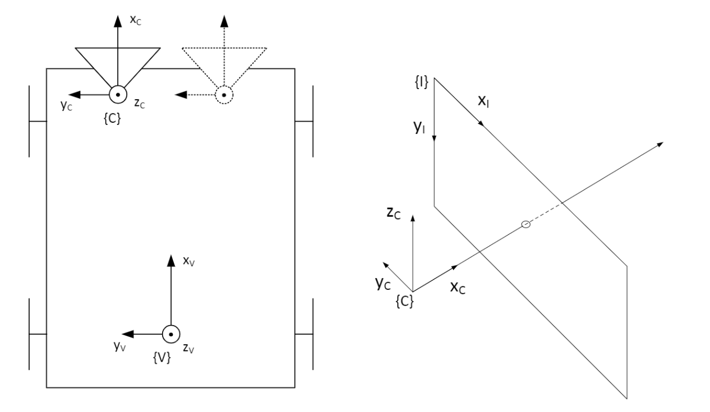

# 基于图像分割的地面障碍物检测

该项目通过在cityscapes数据集下训练语义分割模型deeplabv3+，将分割出来的地面层用于做障碍物的检测

该项目基于cityscapes数据集, 相关链接: https://www.cityscapes-dataset.com/

Pytorch: https://pytorch.org/

以及deeplabv3+框架: https://github.com/rishizek/tensorflow-deeplab-v3-plus

### Step 1: 安装扩展库 ###
 

需要环境：CUDA环境安装(相关教程：https://blog.csdn.net/u011473714/article/details/95042856?utm_medium=distribute.pc_relevant.none-task-blog-title-2&spm=1001.2101.3001.4242)、Python

`pip install -r requirements.txt`

下载准备数据集：https://drive.google.com/file/d/1015wN7V566LJk7toIHCkM9a1UaqShcIq/view?usp=sharing
将`leftImg8bit_trainvaltest.zip`

、`gtFine_trainvaltest.zip`

、`camera_trainvaltest.zip`

三个文件下载后放在cityscapes文件夹下面

### Step 2(方法一): Python运行已训练模型测试  ###

`python3 deeplab_v3plus_best_model.py
`

### Step 2(方法二): 用Juptyer Notebook运行代码  ###

安装Juptyer Notebook，相关教程： https://jupyter.org/install

打开`deeplab_v3plus_best_model.ipynb`运行

### 测试结果 ###
绿点表示测试用户点击。打印结果判断点击位置是否有障碍物。如无则返回相对车的坐标(x、y、z)

  

  

构建世界坐标系基于cityscapes提供的内参外参以及如下车载摄像的结构图，具体文档可参考(https://github.com/mcordts/cityscapesScripts/blob/master/docs/csCalibration.pdf)

  

